# Crypto入门

# 密码学简介

纯粹密码学的考题，在CTF中被称为Crypto类型的题目，有时被归于MISC的一种，常见于线上赛，难度较高。线下赛中也会出现一些Crypto类型的题目，只是通常不会单独出现，而是结合PWN或者Web进行密码学算法的考察，此时不能称之为Crypto类型题目，但是知识点是共通的。从目前国内赛和国际赛的趋势来看，密码学类型的题目开始趋向于与PWN类型、Reverse类型的题目相结合，题目也趋向于前沿化、论文化。  
与其他类型的题目相比，Crypto类型的题目对参赛者的数学功底要求很高，在很大程度上密码学的难点都是数学问题。想要成为一个合格的Crypto选手，扎实的数学功底是必须的，特别是数论的内容一定要掌握透彻。除了数学功底之外，Crypto选手还应该锻炼如下几种能力。  
1）识别能力：能够识别出题目中使用的密码算法或编码算法。  
2）攻击能力：能够结合题目环境设置联想到针对特定算法的攻击方法。  
3）分析能力：能够针对未知算法进行人工分析。  
4）编程能力：能够编程实现破解该算法的程序，并对自己编写的程序的算法复杂度与运行时间有着清醒的认识。  
5）学习能力：能够快速理解最新文献中的密码学攻击方法并加以实现。  
6）跨领域能力：能够掌握Reverse、PWN、Web等其他领域的基本知识（因为现在Crypto与多领域结合的题目较多）。  
多数情况下，不能正确解开Crypto类型题目的原因有两种：不知道该算法的破解方法；不能在有限的时间内解开该题目。  
如果是第一种原因，就需要参赛者针对常见的密码学算法及其攻击方式进行研究和学习。在实际的CTF比赛中，经常使用的密码学算法类型少之又少，比起复杂多样的Web和PWN类型的题目，Crypto可谓清爽简洁。所以，虽然不能要求你了解所有的密码学算法及其攻击方法，但是常见的密码学算法及其攻击类型都应该学习一下。好的比赛中会有一些源自最新论文的密码学题目，此类题目往往具有很高的区分度，需要选手能够找到题目对应的论文出处，并对论文中提出的方法加以实现。  
如果是因为第二种原因，则可以直接认为是破解方法不对。出题者在出密码学题目的时候，考虑到比赛的时间有限，通常会保证题目能在几分钟之内破解完成。但是，如果与同伴对算法经过仔细辩论之后还是认为需要使用这种爆破的思路去解题，那么就需要利用编程和高性能计算机去弥补时间过长的问题。  
密码学可分为古典密码学和现代密码学。古典密码学主要由单表替代、多表替代等加密方法组成，现代密码学则主要包含对称加密、非对称加密、哈希、数字签名等内容。一般来说，密码学的攻击分为：  
1）唯密文攻击：攻击者只拥有密文。  
2）已知明文攻击：攻击者拥有一些与密文对应的明文。  
3）选择明文攻击：攻击者可以进行加密，能够获取指定明文加密后的密文。  
4）选择密文攻击：攻击者可以进行解密，能够获取指定密文解密后的明文。

# 基础数学知识

近世代数（群和域相关知识）、数论

​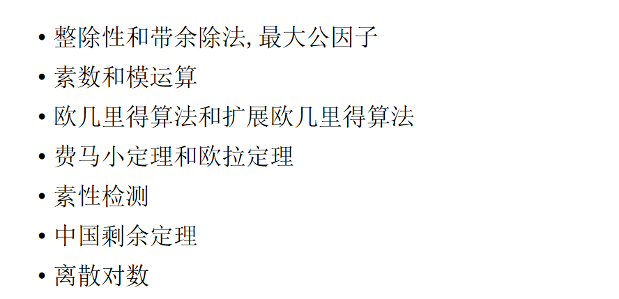​

# 编码

## 1、hex编码

## 2、ASCII编码

## 3、UTF-8

UTF-8（8位元，Universal Character Set/Unicode Transformation Format）是针对Unicode的一种可变长度[字符编码](https://baike.baidu.com/item/%E5%AD%97%E7%AC%A6%E7%BC%96%E7%A0%81/8446880?fromModule=lemma_inlink)

## 4、Unicode

例子：\066、\x66

## 5、URLcode

加密后的URL： https%3A//www.example.com/path%20with%20spaces%3Fparam1%3Dvalue1%26param2%3Dvalue2  
解密后的URL： https://www.example.com/path with spaces?param1=value1&param2=value2

## 6、Base

​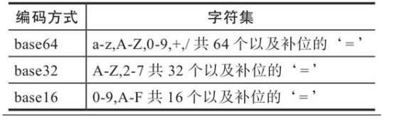

先将明文进行十六进制编码，再根据字母表进行替换加密

# 古典密码

## 1、单表代换

在单表替换加密中，所有的加密方式几乎都有一个共性，那就是明密文一一对应。所以说，一般有以下两种方式来进行破解

	在密钥空间较小的情况下，采用暴力破解方式  
	在密文长度足够长的时候，使用词频分析

### 凯撒密码

凯撒密码 ¶  
原理 ¶  
凯撒密码（Caesar）加密时会将明文中的 每个字母 都按照其在字母表中的顺序向后（或向前）移动固定数目（循环移动）作为密文。例如，当偏移量是 3 的时候（解密时的密钥就是 3）：

明文字母表：ABCDEFGHIJKLMNOPQRSTUVWXYZ  
密文字母表：DEFGHIJKLMNOPQRSTUVWXYZABC  
使用时，加密者查找明文字母表中需要加密的消息中的每一个字母所在位置，并且写下密文字母表中对应的字母。需要解密的人则根据事先已知的密钥反过来操作，得到原来的明文。例如：

明文：THE QUICK BROWN FOX JUMPS OVER THE LAZY DOG  
密文：WKH TXLFN EURZQ IRA MXPSV RYHU WKH ODCB GRJ

破解 ¶  
对于不带密钥的凯撒密码来说，其基本的破解方法有两种方式

遍历 26 个偏移量，适用于普遍情况  
利用词频分析，适用于密文较长的情况。  
其中，第一种方式肯定可以得到明文，而第二种方式则不一定可以得到正确的明文。

而对于基于密钥的凯撒密码来说，一般来说必须知道对应的密钥。（字母表替换）

‍

### 仿射密码

​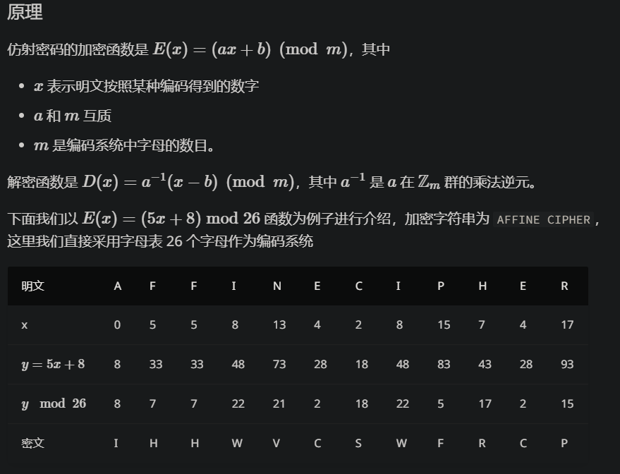​

## 2、多表代换

### 维吉尼亚密码

维吉尼亚密码（Vigenere）是使用一系列凯撒密码组成密码字母表的加密算法，属于多表密码的一种简单形式

​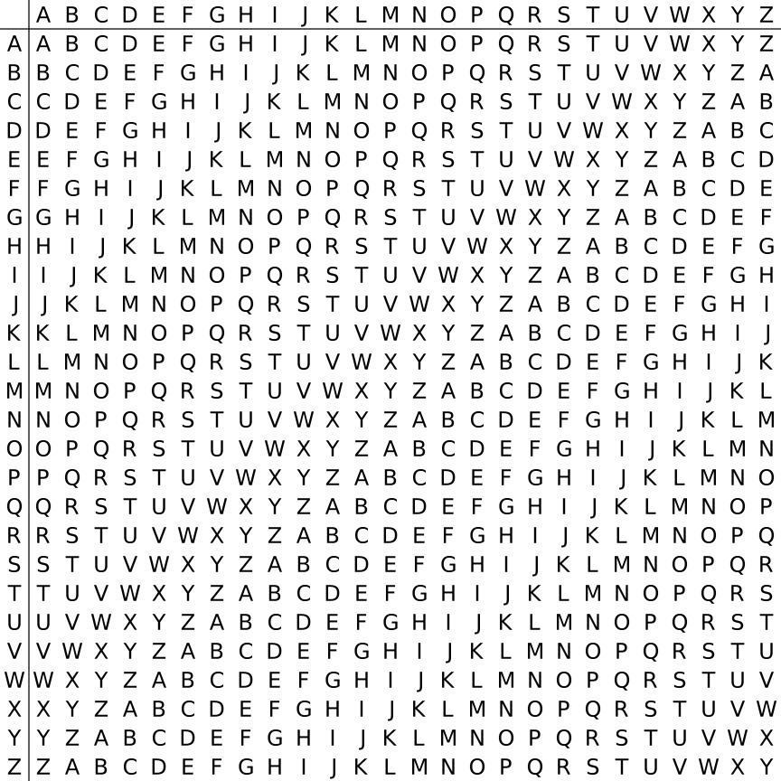

​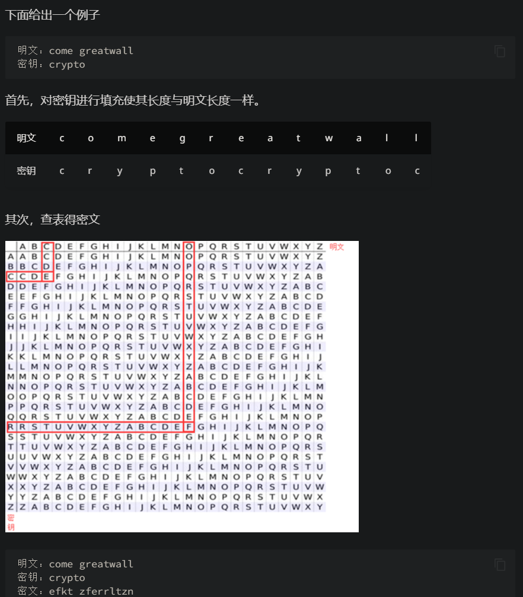​​

## 3、其它加密

### 栅栏加密

​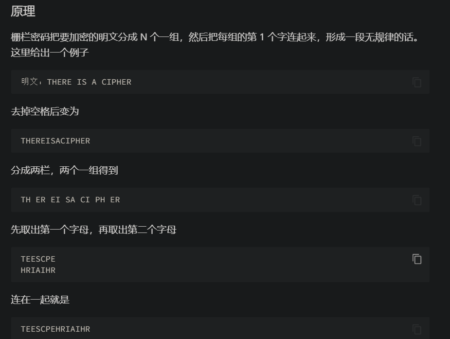​

### 曲路密码

​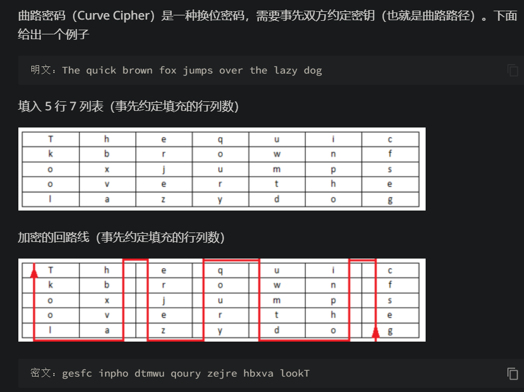​

# 现代密码

​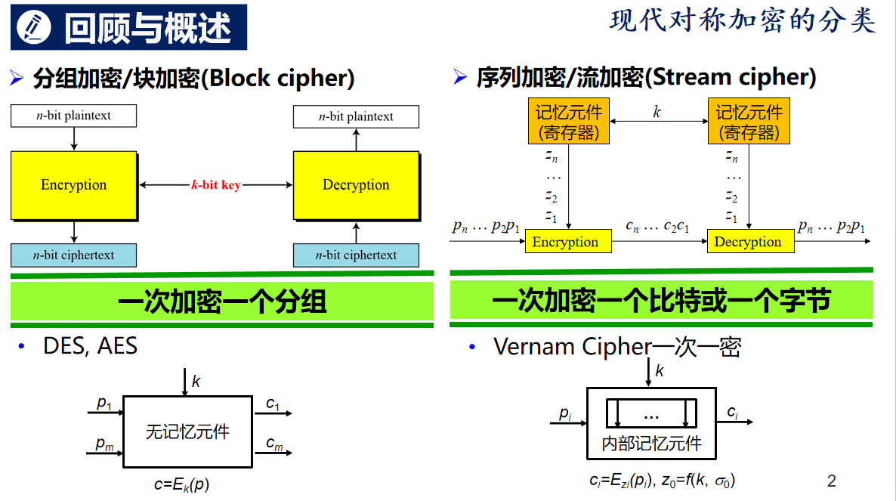​

## 1、序列密码（流密码）

流密码一般逐字节或者逐比特处理信息。一般来说

流密码的密钥长度会与明文的长度相同。  
流密码的密钥派生自一个较短的密钥，派生算法通常为一个伪随机数生成算法。  
需要注意的是，流加密目前来说都是对称加密。

伪随机数生成算法生成的序列的随机性越强，明文中的统计特征被覆盖的更好。

流密码加解密非常简单，在已知明文的情况下，可以非常容易地获取密钥流。

流密码的关键在于设计好的伪随机数生成器。一般来说，伪随机数生成器的基本构造模块为反馈移位寄存器。当然，也有一些特殊设计的流密码，比如 RC4。

### 伪随机数生成器

伪随机数生成器（pseudorandom number generator，PRNG），又称为确定性随机位生成器（deterministic random bit generator，DRBG），是用来生成接近于绝对随机数序列的数字序列的算法。一般来说，PRNG 会依赖于一个初始值，也称为种子，来生成对应的伪随机数序列。只要种子确定了，PRNG 所生成的随机数就是完全确定的，因此其生成的随机数序列并不是真正随机的。

	随机性：随机数应该不存在统计学偏差，是完全杂乱的数列。  
	不可预测性：不能从过去的序列推测出下一个出现的数。  
	不可重现性：除非数列保存下来，否则不能重现相同的数列

随机数又根据是否满足以上三个性质分为弱伪随机数、强伪随机数、真随机数

### 分类

目前通用的伪随机数生成器主要有

线性同余生成器，LCG  
线性回归发生器  
Mersenne Twister  
xorshift generators  
WELL family of generators  
Linear feedback shift register，LFSR，线性反馈移位寄存器

​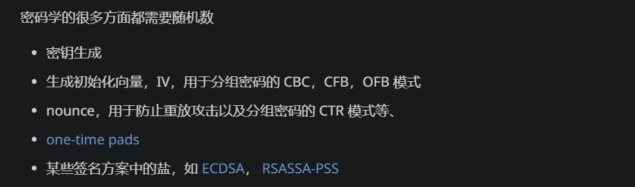​

### 线性同余发生器

​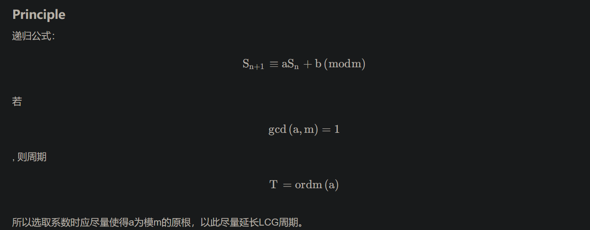​

### 反馈移位寄存器

​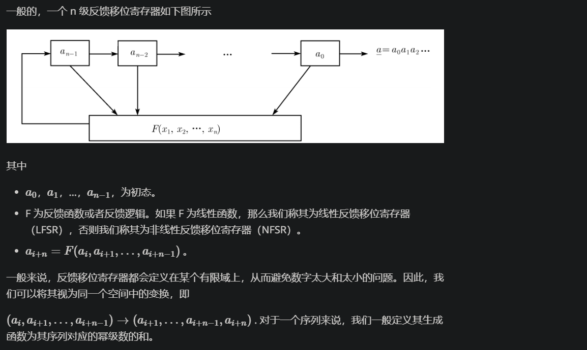

​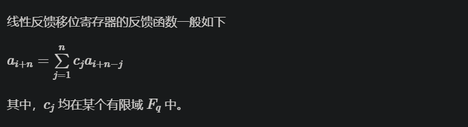

### RC4流密钥

初始化S盒和T数组。S盒是一个256字节的数组，用于存储一个0~255的排列。T数组是由密钥生成的，其长度和S盒相同。

生成密钥流。密钥流是一个与明文长度相等的伪随机数流，其生成方法如下：初始化i和j两个变量（初始值为0），然后对S盒进行256次置换操作。每次操作中，将S[i]和S[j]交换，并以S[i]+S[j] MOD 256作为索引，从S盒中取出一个值，并将其加入到密钥流中。最终得到的密钥流就是T数组经过多轮杂糅后得到的。

将密钥流和明文一一异或。异或操作的规则是：将明文当中的每一个字节和密钥流中的一个字节进行异或操作，得到加密之后的字节流。

​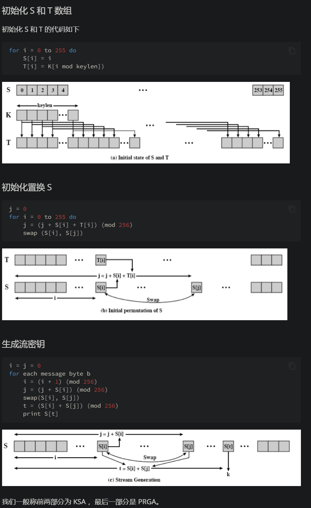​

## 2、分组加密（块加密）

### DES

Data Encryption Standard(DES)，数据加密标准，是典型的块加密，其基本信息如下

输入 64 位。  
输出 64 位。  
密钥 64 位，使用 64 位密钥中的 56 位，剩余的 8 位要么丢弃，要么作为奇偶校验位。  
Feistel 迭代结构  
明文经过 16 轮迭代得到密文。  
密文经过类似的 16 轮迭代得到明文。

​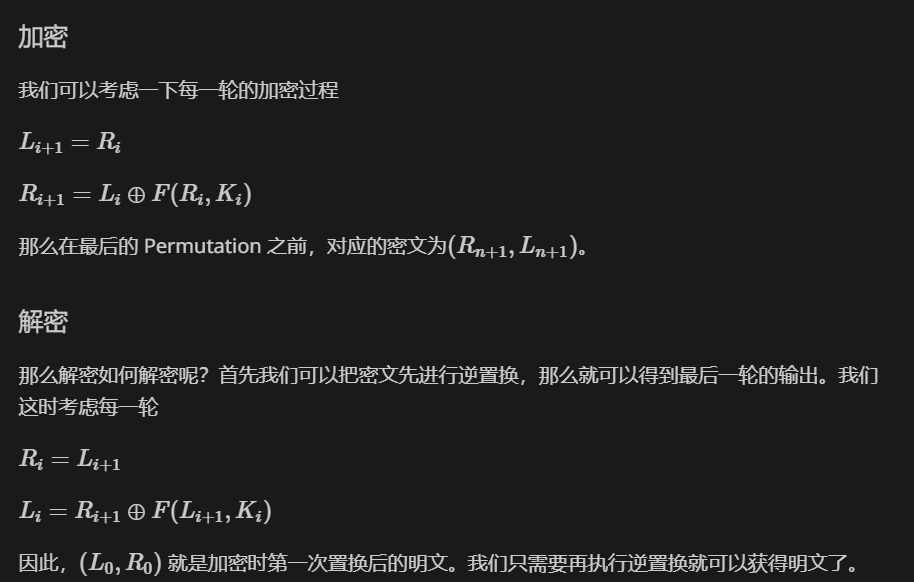

​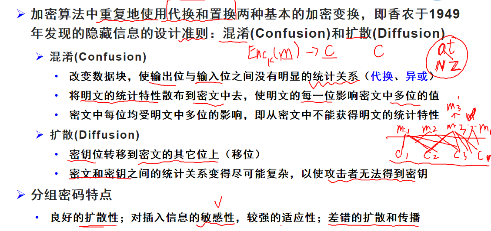​​

### AES

Advanced Encryption Standard（AES），高级加密标准，是典型的块加密，被设计来取代 DES，由 Joan Daemen 和 Vincent Rijmen 所设计。其基本信息如下

输入：128 比特。  
输出：128 比特。  
SPN 网络结构。  
其迭代轮数与密钥长度有关系

​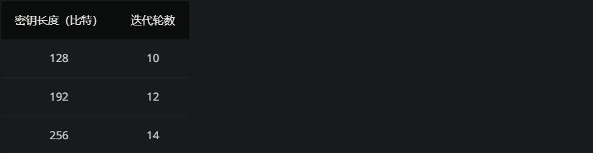​

全轮加密包括四种变换：添加轮密钥、半字节替换、行移位、列混淆，最后一轮没有列混淆

### 填充方式

PKCS5 padding  填充内容为需要填充的比特数----》攻击

特殊情况：

​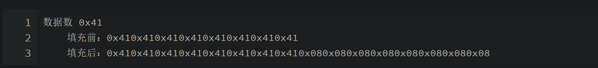​

OneAndZeroes Padding  填充一个0x80，后面全是0x00----》攻击

前面全部填充0x00，最后填充内容为填充byte数----》攻击

全部填充0

全部填充空格

### 分组工作方式

ECB

密码本模式，每次加密使用相同的密钥进行加密，相同的明文每次加密出的结果都相同。

CBC

​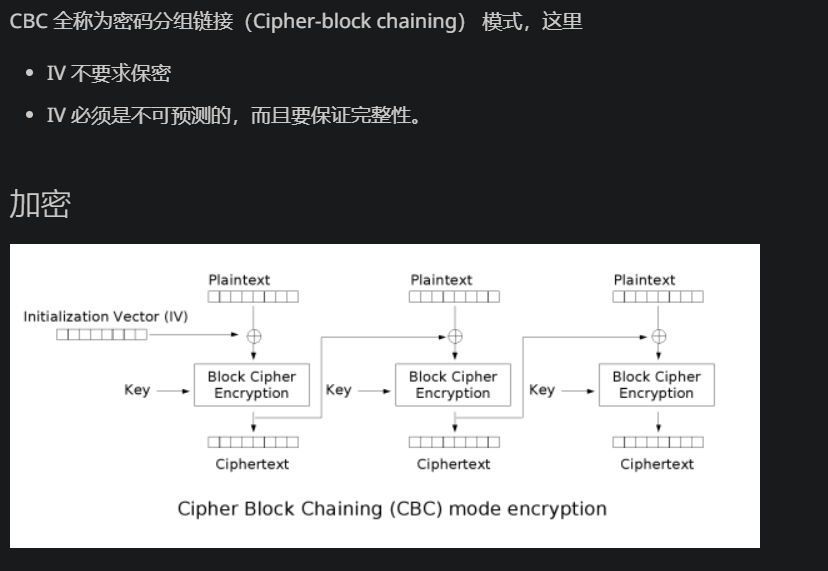

优点 ¶  
密文块不仅和当前密文块相关，而且和前一个密文块或 IV 相关，隐藏了明文的统计特性。  
具有有限的两步错误传播特性，即密文块中的一位变化只会影响当前密文块和下一密文块。  
具有自同步特性，即第 k 块起密文正确，则第 k+1 块就能正常解密。  
缺点 ¶  
加密不能并行，解密可以并行​

## CBC相关攻击

#### CBC翻转比特攻击

	目的：控制解密后的明文

	见例题

#### padding Oracle攻击

1、使用PKCS5 padding填充方式

2、攻击者可以获取密文，可知道padding是否正常

padding oracle攻击是利用服务器通过对padding检查时的不同回显进行的。这是一种侧信道攻击。利用服务器对padding的检查，可以从末位开始逐位爆破明文。

Padding Oracle 攻击是一种针对使用 padding 方式进行加密的系统的攻击方法。该攻击利用了系统在解密密文时会对密文进行解密、解密后进行 padding 验证的过程。攻击者可以通过向系统发送多次密文，逐步猜测出密文中的每个字节，并利用 padding 验证的结果来确定猜测的是否正确，最终破解密文。  
​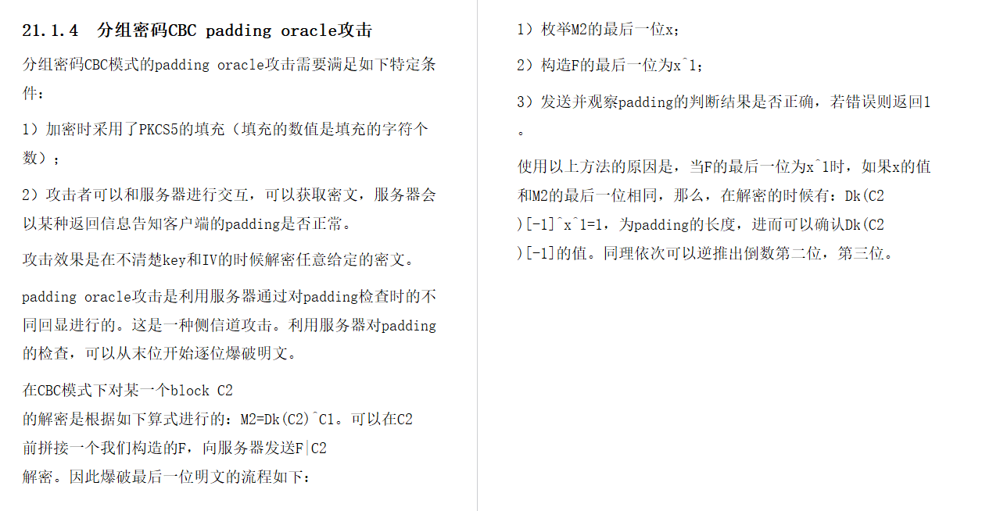​

## 3、非对称加密

加密密钥和解密密钥不相同

### RSA

重要变量：n 、e、p、 q、 d

加密公钥：n、e

解密私钥：p、q、n

​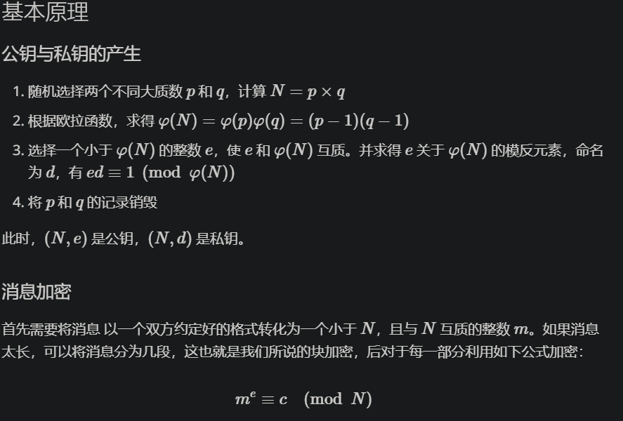​

​​

#### RSA攻击方式

#### n取值过于小

直接模数分解，分解出p和q，进而计算d来解密

（生活中一般认为大于2048bit长度的n是安全的）

#### pq大小差距过大或者过小

费马分解

借助a=(p+q)/2和b=(p-q)/2，利用平方差公式，通过枚举大于n的完全平方数分解n

#### 两次加密使用了相同的p或q（攻击多组加密的情况）

公约数模数分解

对两次加密的公钥n求解公约数，从而实现分解n

#### 使用的e太小了--》小指数明文爆破

可能存在m^e^<n的情况，则直接开方得到明文m

m^e^>n的时候也会由于e过于小导致m不是m^e^不是特别大，从而可以利用m^e^=k*n+c，通过爆破k来解密

#### 选择明文攻击

通过求解C的逆元C^-1^对应的明文，即为原明文的逆元

#### LLL攻击

借助LLL算法在

已知p、q部分bit，并且p的未知部分的上界X和q的未知部分的上界Y满足X*Y≤ sqrt{n}的情况下把n分解出来。并且这种方法在之后广泛应用于RSA体制的小指数攻击和部分私钥泄露攻击等领域，具体可见 LLL算法在RSA安全性分析中的应用。

涉及到CTF中一些题目通常有很大一部分已知明文

#### Wiener 攻击（e很大但是d太小）

一般来说e如果远远大于65537，就可以断定是利用Wiener攻击了

Github上的相关攻击脚本  [https://github.com/pablocelayes/rsa-wiener-attack](https://github.com/pablocelayes/rsa-wiener-attack)

#### 共模攻击（多次加密中使用了相同的n）

如果此时两次加密的m相同，可以不计算d直接得到m的值

## 4、Hash

### HASH函数的要求

(1)单向性(one-wayness 或 preimage resistant)：已知x，求ℎ=H(x)较为容易；但是，已知ℎ，求使得H(x)=ℎ的x在计算上是不可行的

(2)抗弱碰撞性(weak collision resistance 或 second preimage resistant)：已知x，求y且y≠x，使得H(y)=H(x)在计算上是不可行的。

(3)抗强碰撞性(strong collision resistance 或 collision resistant)：找出任意两个不同的x和x’(x≠x′)，使得H(x)=H(x′)计算上是不可行的。

### 哈希碰撞

即爆破，一般超过32bit无法爆破，常见有4位十六进制hash明文爆破

### 哈希扩展长度攻击

# 常用工具

1、各种在线加解密网站

2、[http://quipqiup.com/ ](http://quipqiup.com/)       词频分析解密----》适用于代换加密，且明文长度足够长

3、集成加解密工具   CyberChef     [https://icyberchef.com/](https://icyberchef.com/)

4、质因数分解工具和网站  工具yafu    网站[factordb.com](http://www.factordb.com/)

5、python相关的库   Crypto（pycryptodome）  

# 参考代码链接

1、哈希扩展长度攻击

[http://t.csdn.cn/3m2Ok](http://t.csdn.cn/3m2Ok)

2、RSA共模攻击

[http://t.csdn.cn/Cuucd](http://t.csdn.cn/Cuucd)

‍

‍
